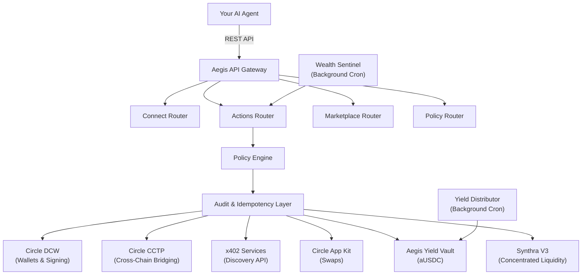

<div align="center">
  

  <h2>Autonomous Wealth Engine for AI Agents</h2>

  <p>
    
    
    
    
    <a href="https://dl.circleci.com/status-badge/redirect/circleci/JF2J1JY7kBmjrj7o7T7ZVD/YVPDoQpe9W3BpNi5HZXCad/tree/main"></a>
  </p>
</div>

---

## Why Aegis?

AI agents reason, but they don't transact safely. They can't hold funds, execute DeFi swaps, or manage portfolios without exposing user keys to hallucinated logic.

Aegis acts as a financial firewall. Agents send intents (e.g., "deposit idle USDC for yield") to the Aegis API. Aegis executes the transaction natively on the Arc Testnet, but only after enforcing strict cryptographic policies, idempotency locks, and hard spending caps.

## Core Architecture

Aegis routes intents through a strict validation pipeline before execution:



### Built for Autonomy
* **The `SKILL.md` Protocol**: Aegis provides a live `SKILL.md` endpoint meant for LLM system prompts. It teaches the agent how to negotiate transactions and understand platform constraints natively.
* **Cryptographic Guardrails**: The idempotency protocol and policy engine prevent agents from double-spending or bypassing approved limits.

### Autonomous Wealth Engine
* **Auto-Compounding Yield**: Agents deposit idle USDC into the Aegis ERC-4626 Vault to earn auto-compounding yield.
* **Smart Routing**: Support for limit orders, bound DCA schedules, and multi-yield allocation.
* **Tax Loss Harvesting**: Automated FIFO cost-basis analysis and offsetting trade execution.

### Native Interoperability
* **Arc Network Layer**: Built natively on the Arc Testnet for low-cost execution.
* **Circle CCTP**: Cross-chain bridging of USDC across 7+ testnets.
* **x402 Micropayments**: Agents discover and pay for external APIs directly from their Aegis balance.

---

## Monorepo Structure

The repository is modularized:

| Directory | Purpose | Repository Status |
|-----------|---------|-------------------|
| `aegis/` | REST API backend and policy engine. | [Standalone Repo](https://github.com/Wizbisy/aegis) |
| `aegis-ui/` | Next.js control plane for administrative oversight. | Included here |
| `contracts/` | Solidity smart contracts (ERC-4626 Vaults). | Included here |
| `docs/` | Mintlify documentation site. | [Standalone Repo](https://github.com/Wizbisy/mintlify-docs) |

---

## Technology Stack

* **Blockchain**: Arc Testnet (Chain ID: `5042002`)
* **Wallets**: Circle Developer Controlled Wallets (DCW)
* **Cross-Chain**: Circle CCTP
* **Backend**: Node.js, TypeScript, Hono, Prisma, PostgreSQL
* **Frontend**: Next.js 15, Tailwind CSS v4, Framer Motion
* **Smart Contracts**: Solidity, Foundry, OpenZeppelin

---

## Local Development

### 1. Backend Setup (`aegis/`)
```bash
cd aegis
npm install
cp .env.example .env 
npx prisma generate
npm run dev
```

### 2. Frontend Control Plane (`aegis-ui/`)
```bash
cd aegis-ui
npm install
npm run dev
```

### 3. Smart Contracts (`contracts/`)
```bash
cd contracts
forge build
forge test 
```

---

## Documentation

The API reference and integration guides are hosted on Mintlify.

👉 **[Read the Aegis Documentation](https://docs.aegisintent.xyz)**

To view the documentation locally:
```bash
cd docs
npx mintlify dev
```

---

## Live Infrastructure Links

* **Live API**: `https://api.aegisintent.xyz`
* **Agent Skill File**: `https://api.aegisintent.xyz/SKILL.md`
* **Documentation**: `https://docs.aegisintent.xyz`
* **Aegis Vault Contract**: [`0xAf5f79495285b1d180858a225aDE518d371e0167`](https://testnet.arcscan.app/address/0xAf5f79495285b1d180858a225aDE518d371e0167) 
* **Arc Explorer**: [testnet.arcscan.app](https://testnet.arcscan.app)

---

<div align="center">
  <p>Built by <a href="https://github.com/Wizbisy">@wizbisy</a> for the future of Autonomous Finance.</p>
</div>
