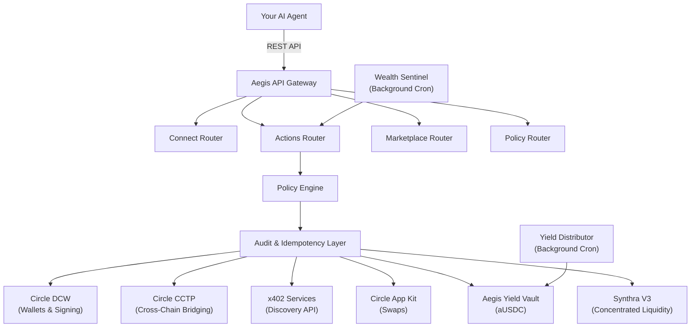

<div align="center">
  

  <h2>Autonomous Wealth Engine for AI Agents</h2>
  <p>Built for the <a href="https://agora.thecanteenapp.com/">Agora Agents Hackathon</a> by Canteen × Circle</p>

  <p>
    
    
    
    
  </p>
</div>

---

## The Paradigm Shift

**The Problem:** AI Agents are becoming highly intelligent, but they are financially paralyzed. They cannot safely hold money, they struggle to interact with complex DeFi protocols, and they cannot securely manage long-term wealth without risking user funds to hallucinated transactions.

**The Solution:** **Aegis** is a security-hardened, intent-based financial layer designed explicitly for AI. It acts as an unbreakable firewall between the AI agent's brain and its wallet. Agents interact with Aegis via natural intents (e.g., "Yield my idle USDC"), and Aegis executes the transactions natively on **Arc**, enforcing strict cryptographic policies, idempotency, and spending caps.

## Core Architecture

To safely bridge intelligent agents to onchain execution, Aegis enforces a strict validation and intent-routing pipeline:



### Built for Autonomy
* **The `SKILL.md` Protocol**: Aegis provides a live, dynamic `SKILL.md` endpoint that can be ingested into any LLM's system prompt. This instantly teaches the agent how to natively negotiate transactions and understand platform constraints.
* **Cryptographic Guardrails**: A strict idempotency protocol and policy engine completely prevents agents from double-spending or executing unapproved operations.

### Autonomous Wealth Engine
* **Auto-Compounding Yield**: Agents can securely deposit idle USDC into the Aegis ERC-4626 Vault to programmatically earn and compound yield over time.
* **Smart Routing**: Advanced support for Limit Orders, order count bound DCA schedules, and multi-yield allocation strategies.
* **Tax Loss Harvesting**: Automated FIFO and LIFO cost-basis analysis executed directly onchain.

### Native Interoperability
* **Arc Network Layer**: Built natively on the Arc Testnet for scalable, deterministic execution.
* **Circle CCTP**: Instant cross-chain bridging of USDC across 7+ testnets, allowing agents to move liquidity securely.
* **x402 Micropayments**: Agents can autonomously discover and pay for external APIs and data services directly from their Aegis balance.

---

## Monorepo Structure

Because Aegis is a comprehensive full-stack infrastructure, the repository is cleanly modularized:

| Directory | Purpose | Repository Status |
|-----------|---------|-------------------|
| `aegis/` | The core REST API backend and policy engine. | [Standalone Repo](https://github.com/Wizbisy/aegis) |
| `aegis-ui/` | The Next.js control plane for administrative oversight. | Included here |
| `contracts/` | Solidity smart contracts (ERC-4626 Vaults). | Included here |
| `docs/` | The comprehensive Mintlify documentation site. | [Standalone Repo](https://github.com/Wizbisy/mintlify-docs) |

---

## Technology Stack

* **Blockchain**: Arc Testnet (Chain ID: `5042002`)
* **Wallets**: Circle Developer Controlled Wallets (DCW)
* **Cross-Chain**: Circle CCTP
* **Backend**: Node.js, TypeScript, Hono, Prisma, PostgreSQL
* **Frontend**: Next.js 14, Tailwind CSS, Framer Motion
* **Smart Contracts**: Solidity, Foundry, OpenZeppelin

---

## Local Development

### 1. Backend Setup (`aegis/`)
```bash
cd aegis
npm install
cp .env.example .env 
npx prisma generate
npm run dev
```

### 2. Frontend Control Plane (`aegis-ui/`)
```bash
cd aegis-ui
npm install
npm run dev
```

### 3. Smart Contracts (`contracts/`)
```bash
cd contracts
forge build
forge test 
```

---

## Comprehensive Documentation

Our full API reference, architecture guides, and agent integration tutorials are hosted on our dedicated Mintlify site.

👉 **[Read the Aegis Documentation](https://docs.aegisintent.xyz)**

To view the documentation locally:
```bash
cd docs
npx mintlify dev
```

---

## Live Infrastructure Links

* **Live API**: `https://api.aegisintent.xyz`
* **Agent Skill File**: `https://api.aegisintent.xyz/SKILL.md`
* **Documentation**: `https://docs.aegisintent.xyz`
* **Aegis Vault Contract**: [`0xAf5f79495285b1d180858a225aDE518d371e0167`](https://testnet.arcscan.app/address/0xAf5f79495285b1d180858a225aDE518d371e0167) 
* **Arc Explorer**: [testnet.arcscan.app](https://testnet.arcscan.app)

---

<div align="center">
  <p>Built by <a href="https://github.com/Wizbisy">@wizbisy</a> for the future of Autonomous Finance.</p>
</div>
