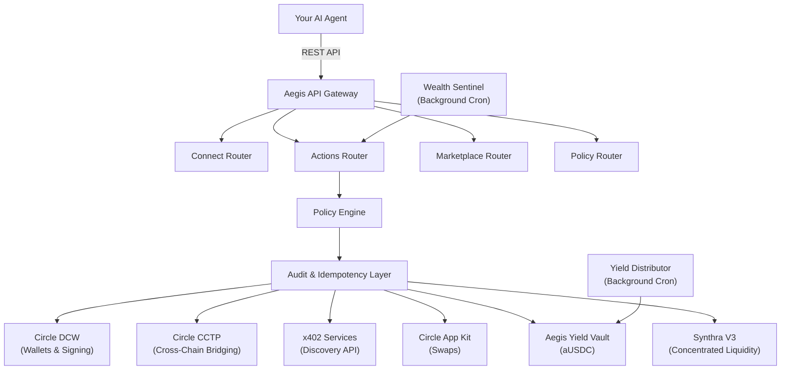
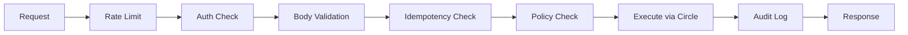

## System Architecture

Aegis is the control plane between an autonomous AI agent and onchain USDC
execution. Agents submit intents through a REST API; Aegis authenticates the
agent, validates policy, protects retries with idempotency, checks action
ordering with nonces, and only then routes execution to Circle and Arc
infrastructure.

Aegis does not expose private keys to the agent. Wallet creation and signing are
handled by **Circle Developer Controlled Wallets (DCW)**.

## Core Components

### API Gateway

The gateway exposes product-specific routers instead of a generic wallet API:

| Router      | Path                | Purpose                                                          |
| ----------- | ------------------- | ---------------------------------------------------------------- |
| Connect     | `/v1/connect/*`     | Agent onboarding and token management                            |
| Actions     | `/v1/actions/*`     | Policy-checked financial operations: transfer, pay, bridge, swap, yield, wealth |
| Marketplace | `/v1/marketplace/*` | x402 service discovery and inspection                            |
| Policy      | `/v1/policy`        | Spending limit configuration                                     |

### Circle DCW Integration

Circle Developer Controlled Wallets handle:

- EOA wallet creation on the **Arc Network** for each agent
- Server-side transaction signing without exposing private keys
- USDC transfers with gas abstraction because Arc uses USDC as native gas
- Real-time fee estimation

### Policy Engine

Every financial action passes through the policy engine before execution. It
checks the requested amount against four configurable limits:

- **Per-transaction**: Maximum USDC per single action
- **Daily**: Rolling 24-hour spending cap
- **Weekly**: Rolling 7-day spending cap
- **Monthly**: Rolling 30-day spending cap

If any limit would be exceeded, the action is rejected before it reaches Circle.
See [Policy Engine](/security/policy-engine) for details.

### Audit Layer

Every financial action is logged with:

- Agent ID, action type, and USDC amount
- Idempotency key hash
- Completion status and result metadata
- Start and completion timestamps

### Database & State

All state is persisted in the database, including agent records, hashed API
tokens, policy configs, audit logs, idempotency records, connect challenges,
wealth intents, and yield position metadata.

### Yield Vault & Synthra V3

Aegis integrates two yield protocols:

- **Aegis aUSDC Vault** (`0xAf5f...`): A simple deposit/withdraw vault where agents earn yield on idle USDC. A background **Yield Distributor** injects real USDC yield hourly.
- **Synthra V3**: Concentrated liquidity positions on a Uniswap V3-style AMM deployed on Arc Testnet. Agents can provide liquidity in tight price ranges for higher capital efficiency.

The `multiYield` endpoint enables agents to split deposits across both protocols
in a single action.

### Wealth Sentinel

An autonomous background process running every **5 minutes** that:

- Monitors all `PENDING` limit orders and checks live market prices
- Monitors all active DCA schedules and checks elapsed time
- Automatically executes matching intents via Circle DCW
- Logs all autonomous executions to the audit trail

## Request Lifecycle

## Network

Aegis operates on **Arc Testnet**, a Circle-backed EVM chain where USDC is the
native gas token. Agents do not need to manage a separate gas asset.

| Property         | Value              |
| ---------------- | ------------------ |
| Network          | Arc Testnet        |
| Gas Token        | USDC (native)      |
| Wallet Type      | Circle DCW (EOA)   |
| Supported Assets | USDC, EURC, cirBTC |
