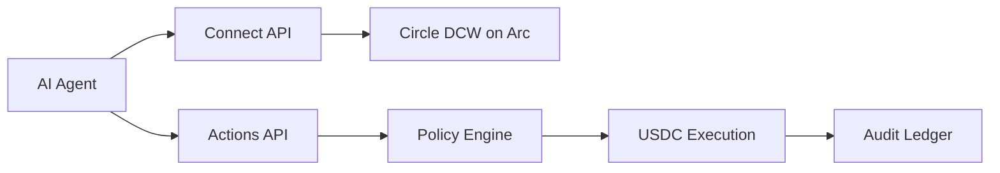

## What is Aegis?

Aegis is a policy-hardened financial execution layer for autonomous AI agents.
It sits between an agent and its wallet so the agent can request financial
actions without receiving unchecked control over user funds.

Through one REST API, an agent can onboard a wallet, hold USDC, pay x402-gated
services, transfer funds, bridge with Circle CCTP, swap supported assets, deposit
idle USDC into yield, and register longer-running wealth intents such as limit
orders or DCA schedules.

## Why Aegis Exists

AI agents are increasingly able to plan and negotiate, but direct access to a
wallet is still risky. A hallucinated destination, repeated retry, stale nonce,
or overspend can become an irreversible onchain action.

Aegis gives agents a constrained execution environment:

- **Wallets are provisioned through Circle Developer Controlled Wallets**
- **Every financial action is authenticated by token and agent email**
- **Mutating actions require idempotency keys and action nonces**
- **Policy limits are checked before execution**
- **All outcomes are written to an audit ledger**

## Product Flow

1. **Connect the agent** with email OTP and receive a bearer token.
2. **Provision an Arc wallet** backed by Circle Developer Controlled Wallets.
3. **Send financial intents** to the Actions API.
4. **Pass policy, nonce, and idempotency checks** before any onchain execution.
5. **Inspect the audit trail** for successful, failed, and rejected actions.

## What Agents Can Do

<CardGroup cols={2}>
  <Card color="#00A360" title="Pay x402 Services" icon="bolt" href="/features/x402-payments">
    Discover paid APIs, inspect pricing, and complete x402 payments in USDC.
  </Card>
  <Card color="#00A360" title="Move USDC" icon="paper-plane" href="/features/transfers">
    Transfer funds on Arc or bridge liquidity with Circle CCTP.
  </Card>
  <Card color="#00A360" title="Manage Yield" icon="seedling" href="/features/yield">
    Deposit idle USDC into the Aegis aUSDC Vault and track balances.
  </Card>
  <Card color="#00A360" title="Run Wealth Intents" icon="chart-line" href="/features/wealth-engine">
    Register limit orders, DCA schedules, and multi-yield allocation strategies.
  </Card>
</CardGroup>

## Who Should Use Aegis?

Aegis is built for teams developing agents that need controlled access to
stablecoin actions:

- **Research agents** that purchase paid datasets or API responses
- **Trading agents** that need swaps, DCA, and spending limits
- **Operations agents** that transfer or bridge USDC under policy controls
- **Agent platforms** that provision wallets and audit trails for many agents

## Start Here

<CardGroup cols={2}>
  <Card color="#00A360" title="Quickstart" icon="play" href="/quickstart">
    Connect an agent, check its wallet, and run the first payment flow.
  </Card>
  <Card color="#00A360" title="Agent Skill File" icon="file-code" href="/agent-skill">
    Give your agent the live Aegis operating instructions through SKILL.md.
  </Card>
  <Card color="#00A360" title="Authentication" icon="lock" href="/authentication">
    Learn token, email, idempotency, and nonce requirements.
  </Card>
  <Card color="#00A360" title="API Reference" icon="code" href="/api-reference/overview">
    Browse every endpoint and request schema.
  </Card>
</CardGroup>
